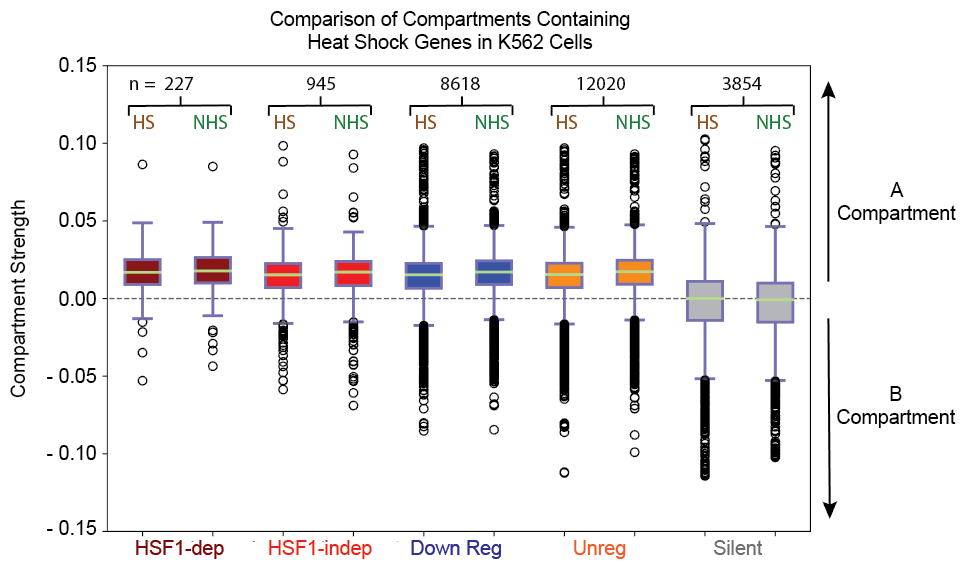
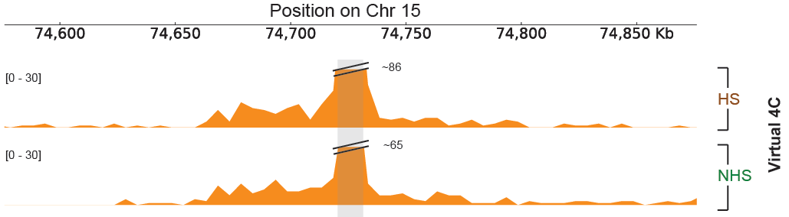

# HS_transcription_regulation
Heat shock driven transcription regulation correlated with underlying 3D chromatin contacts

Heat shock initiates rapid, extensive, and evolutionarily conserved changes in the transcription of thousands of genes. Transcriptional activation during heat shock involves chromatin decondensation and nucleosome loss accompanied with binding of the transcription factor heat shock factor 1 (HSF1 ) that results in the release of paused RNA polymerase II (Pol II) into productive elongation. Here we have employed Hi-C to determine how heat stress affects long-range chromatin conformation  in human and Drosophila cells. We found that topologically-associated domains (TADs), compartments, and loop interactions all remain unchanged by a short duration of heat shock. Many HSF1-dependent genes rely on distal HSF1 binding to enhancer elements, however enhancer-promoter contacts are already established in the non-heat shock condition and exhibit minimal changes in contact frequency in both human and Drosophila cells. Our results suggest that the chromatin conformation necessary for a robust heat shock response is pre-established in resting cells that could rapidly drive the activation of the responsive genes.

## Citation

If you use this code or the resulting assemblies, please cite the following paper:

Judhajeet Ray, Paul R. Munn, Anniina Vihervaara, Abdullah Ozer, Charles G. Danko, John T. Lis (2018). *Pre-established three-dimensional chromatin contacts underlie heat shock driven transcriptional regulation.* PNAS. <date>; <vol.> <pages>. doi: <link>

## Prerequisites

* `Bash >= 4`
* `Python >= 2.7`
* `scipy, numpy, matplotlib, getopt, <other modules>`
* `R >= 3.4.2`

## Installation

There is no need for installation

## Program usage

### Figure 2C: Comparison of compartments containing heat shock genes

```
gene_class_compartment_strength_boxplots.py
```

This code takes as input vectors of compartment strengths for compartments containing genes from each of the different groups in our study and produces box plots comparing compartment strength between HS and NHS for genes in these groups.

Program usage:

```
python gene_class_compartment_strength_boxplots.py \
-a <input file for HS HSF-dependent genes> \
-b <input file for NHS HSF-dependent genes> \
-c <input file for HS HSF-independent genes> \
-d <input file for NHS HSF-independent genes> \
-e <input file for HS down regulated genes> \
-f <input file for NHS down regulated genes> \
-g <input file for HS unregulated genes> \
-i <input file for NHS unregulated genes> \
-j <input file for HS silent genes> \
-k <input file for NHS silent genes> \
-o <output file prefix> -l <plot title> -t -h
```

Input parameters:

* Input files: Files containing a single column of numbers representing compartment strengths for each bin along the chromatin for each gene class
* Output file: File name prefix for plot (see output files below)
* -l: Plot title
* -t: Testing flag
* -h: Show usage help

Example:

```
python gene_class_compartment_strength_boxplots.py \
-a data/K562_HS_combined_KRnorm_all_50K_eigen_HSF-dependent_all_genes.txt \
-b data/K562_NHS_combined_KRnorm_all_50K_eigen_HSF-dependent_all_genes.txt \
-c data/K562_HS_combined_KRnorm_all_50K_eigen_HSF-independent_all_genes.txt \
-d data/K562_NHS_combined_KRnorm_all_50K_eigen_HSF-independent_all_genes.txt \
-e data/K562_HS_combined_KRnorm_all_50K_eigen_down_reg.txt \
-f data/K562_NHS_combined_KRnorm_all_50K_eigen_down_reg.txt \
-g data/K562_HS_combined_KRnorm_all_50K_eigen_unreg.txt \
-i data/K562_NHS_combined_KRnorm_all_50K_eigen_unreg.txt \
-j data/K562_HS_combined_KRnorm_all_50K_eigen_silent.txt \
-k data/K562_NHS_combined_KRnorm_all_50K_eigen_silent.txt \
-o output/K562_HS_NHS_gene_class_all_50K_boxplot \
-l 'Comparison of Gene Classes in K562 Cells' \
-t
```

Input text file format:

Single vector of numbers representing compartment strengths for each bin along the chromatin for each gene class.

Output files:




The program produces box plots comparing compartment strength between HS and NHS for compartments containing genes from each group in our study.


### Figure 4B: Virtual 4C tracks

```
virtual_4C_interactions.py 
```

This code takes a file of anchor points and a paired contacts file and produces virtual 4C data in the form of a bedgraph file 

Program usage:

```
python virtual_4C_interactions.py -s <input TSS file> -r <input paired contacts file> -w <window size> -b <bin size> -o <output bedgraph file prefix> -t -h
```

Input parameters:

* Input TSS file: a .bed file containing each of the anchor points you want to examine (the code produces one bedgraph file for each anchor point) - see below for format
* Input paired contacts file: see contact map format below for details
* Window size: Size of region (in bp) around each anchor point
* Bin size: Size of each sub-division of the window (in bp) for which contact end points are summed
* Output bedgraph file: File name prefix for bedgraph file (see output files below)
* -t: Testing flag
* -h: Show usage help

Example:

```
python virtual_4C_interactions.py \
-s data/HSF1dependently_induced_genes_K562_TSS_only_greater_than_10K.bed \
-r data/K562_HS_combined_merged_nodups.txt \
-o output/K562_HS_combined_virtual_4C_output_10K \
-w 2000000 -b 10000 -q 30 -t
```

Input TSS bed file format:

Standard, 6-column .bed file: Chromosome, Start position of TSS, End position, Name, Score, Strand (note: Start and End should be one bp apart)

Contact map format:

This file consists of paired contacts in the format produced by the [Aiden lab’s Juicer pipeline](https://github.com/aidenlab/juicer) at https://github.com/aidenlab/juicer: 

Column 0: strand 1 (0 for forward, anything else for reverse) <br />
Column 1: chromosome 1 <br />
Column 2: position 1 <br />
Column 3: restriction site fragment 1 (not used by my code) <br />
Column 4: strand 2 (0 for forward, anything else for reverse) <br />
Column 5: chromosome 2 <br />
Column 6: position 2 <br />
Column 7: restriction site fragment 2 (not used by my code) <br />

Note: The merged_nodups.txt file used in the example is too large to store here (approx. 34 Gb) and so will need to be produced by concatenating the fastq files from our Hi-C assays after heat shock (<links>) and running them through the Aiden lab’s Juicer pipeline (see link above).

Output files:




The program produces one bedgraph file for each anchor point in the input TSS file. These files contain columns for chromosome, start and end positions for each bin, and a read count for each bin.


