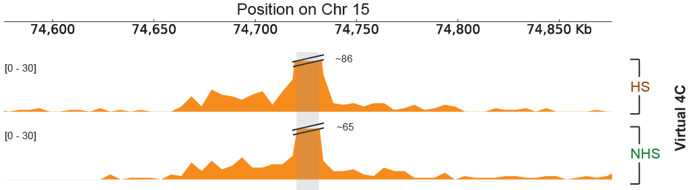

# HS_transcription_regulation
Heat shock driven transcription regulation correlated with underlying 3D chromatin contacts
<description>
## Citation
If you use this code or the resulting assemblies, please cite the following paper:
<paper>

## Prerequisites
```
* Bash >= 4
* Python >= 2.7
* scipy, numpy, matplotlib, getopt, <other modules>
* R >= 3.4.2
```

## Installation

There is no need for installation

## Program usage

### Figure 2C: xxx

```
gene_class_compartment_strength_boxplots.py
```

This code xxx Xxx and produces box plots comparing compartment strength between HS and NHS for genes in multiple classes.

Program usage:

```
python gene_class_compartment_strength_boxplots.py \
-a <input file for HS HSF-dependent genes> \
-b <input file for NHS HSF-dependent genes> \
-c <input file for HS HSF-independent genes> \
-d <input file for NHS HSF-independent genes> \
-e <input file for HS down regulated genes> \
-f <input file for NHS down regulated genes> \
-g <input file for HS unregulated genes> \
-i <input file for NHS unregulated genes> \
-j <input file for HS silent genes> \
-k <input file for NHS silent genes> \
-o <output file prefix> -l <plot title> -t -h
```

Input parameters:

* Input files: Files containing a single column of numbers representing compartment strengths for each bin along the chromatin for each gene class
* Output file: File name prefix for plot (see output files below)
* -l: Plot title
* -t: Testing flag
* -h: Show usage help

Example:

```
python gene_class_compartment_strength_boxplots.py \
-a data/K562_HS_combined_KRnorm_all_50K_eigen_HSF-dependent_all_genes.txt \
-b data/K562_NHS_combined_KRnorm_all_50K_eigen_HSF-dependent_all_genes.txt \
-c data/K562_HS_combined_KRnorm_all_50K_eigen_HSF-independent_all_genes.txt \
-d data/K562_NHS_combined_KRnorm_all_50K_eigen_HSF-independent_all_genes.txt \
-e data/K562_HS_combined_KRnorm_all_50K_eigen_down_reg.txt \
-f data/K562_NHS_combined_KRnorm_all_50K_eigen_down_reg.txt \
-g data/K562_HS_combined_KRnorm_all_50K_eigen_unreg.txt \
-i data/K562_NHS_combined_KRnorm_all_50K_eigen_unreg.txt \
-j data/K562_HS_combined_KRnorm_all_50K_eigen_silent.txt \
-k data/K562_NHS_combined_KRnorm_all_50K_eigen_silent.txt \
-o output/K562_HS_NHS_gene_class_all_50K_boxplot \
-l 'Comparison of Gene Classes in K562 Cells' \
-t
```

Input text file format:

Single column of numbers representing compartment strengths for each bin along the chromatin for each gene class.

Output files:


The program produces xxx.


### Figure 4A: xxx

```
contact_distance_using_standard_error_6_plots.py 
```

xxx


Xxx


### Figure 4B: Virtual 4C tracks

```
virtual_4C_interactions.py 
```

This code takes a file of anchor points and a paired contacts file and produces virtual 4C data in the form of a bedgraph file 

Program usage:

```
python virtual_4C_interactions.py -s <input TSS file> -r <input paired contacts file> -w <window size> -b <bin size> -o <output bedgraph file prefix> -t -h
```

Input parameters:

* Input TSS file: a .bed file containing each of the anchor points you want to examine (the code produces one bedgraph file for each anchor point) - see below for format
* Input paired contacts file: see contact map format below for details
* Window size: Size of region (in bp) around each anchor point
* Bin size: Size of each sub-division of the window (in bp) for which contact end points are summed
* Output bedgraph file: File name prefix for bedgraph file (see output files below)
* -t: Testing flag
* -h: Show usage help

Example:

```
python virtual_4C_interactions.py -s data/HSF1dependently_induced_genes_K562_TSS_only_greater_than_10K.bed -r data/K562_HS_combined_merged_nodups.txt -o output/K562_HS_combined_virtual_4C_output_10K -w 2000000 -b 10000 -t
```

Input TSS bed file format:

Standard, 6-column .bed file: Chromosome, Start position of TSS, End position, Name, Score, Strand (note: Start and End should be one bp apart)

Contact map format:

This file consists of paired contacts in the format produced by the Aiden lab’s Juicer pipeline: 
Column 0: strand 1 (0 for forward, anything else for reverse)
Column 1: chromosome 1
Column 2: position 1
Column 3: restriction site fragment 1 (not used by my code)
Column 4: strand 2 (0 for forward, anything else for reverse)
Column 5: chromosome 2
Column 6: position 2
Column 7: restriction site fragment 2 (not used by my code)

Output files:




The program produces one bedgraph file for each anchor point in the input TSS file. These files contain columns for chromosome, start and end positions for each bin, and a read count for each bin.

### Figure 4C: xxx

```
interactions_w_closest_site_difference_multiple_bars_2.py 
```

Output:


Xxx


### Figure 5 (A, B, C, D): xxx

List datasets

### Supplement 1: xxx

```
distal_enhancer_distance_cdf_four_plots.py 
```

Output


Xxx


### Supplement 2: xxx

List datasets

### Supplement 3: xxx

List datasets

### Supplement 4: xxx

List datasets


Delete the rest:


virtual_4C_interactions.py 

This code takes a file of anchor points and a paired contacts file and produces virtual 4C data in the form of a bedgraph file 

Program usage:

virtual_4C_interactions.py -s <input TSS file> -r <input paired contacts file> -w <window size> -b <bin size> -o <output bedgraph file> -t -h

Input parameters:

* Input TSS file: a .bed file containing each of the anchor points you want to examine (the code produces one bedgraph file for each anchor point) - see below for format
* Input paired contacts file: see contact map format below for details
* Window size: Size of region (in bp) around each anchor point
* Bin size: Size of each sub-division of the window (in bp) for which contact end points are summed
* Output bedgraph file: File name for bedgraph file (see output files below)
* -t: Testing flag
* -h: Show usage help

Example:

python virtual_4C_interactions.py -s K562_PRO-seq/HSF1dependently_induced_genes_K562_TSS_only_greater_than_10K.bed -r aligned_K562_NHS_combined/merged_nodups.txt -o K562_NHS_combined_virtual_4C_output_10K -w 2000000 -b 10000 -t

Input TSS bed file format:

Standard, 6-column .bed file: Chromosome, Start position of TSS, End position, Name, Score, Strand (note: Start and End should be one bp apart)

Contact map format:

This file consists of paired contacts in the format produced by the Aiden lab’s Juicer pipeline: 
Column 0: strand 1 (0 for forward, anything else for reverse)
Column 1: chromosome 1
Column 2: position 1
Column 3: restriction site fragment 1 (not used by my code)
Column 4: strand 2 (0 for forward, anything else for reverse)
Column 5: chromosome 2
Column 6: position 2
Column 7: restriction site fragment 2 (not used by my code)

Output files:

The program produces one bedgraph file for each anchor point in the input TSS file. These files contain columns for chromosome, start and end positions for each bin, and a read count for each bin.

